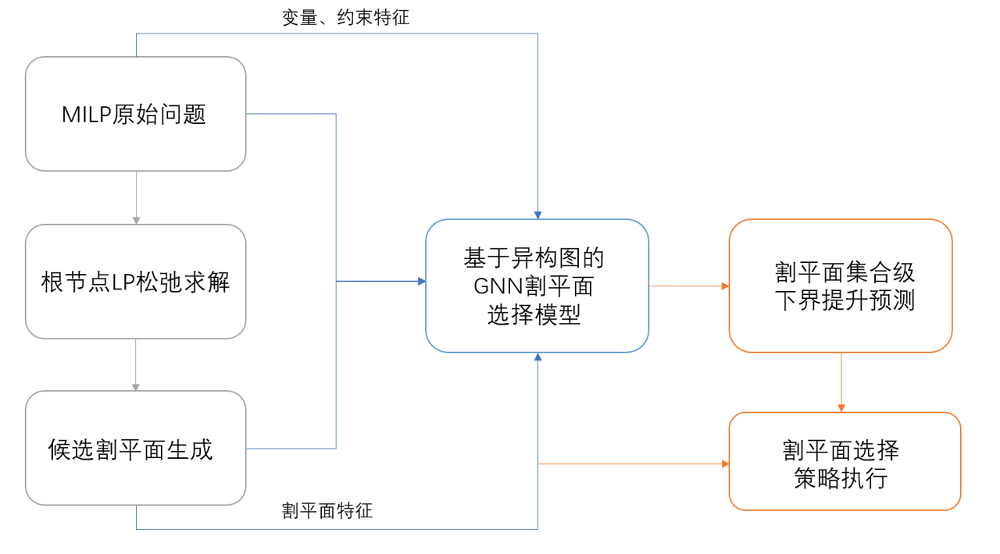

# HeteroCut-GNN: Heterogeneous Graph Neural Networks for Set-Level Cutting Plane Selection

[](https://www.python.org/downloads/)
[](https://pytorch.org/)
[](https://pytorch-geometric.readthedocs.io/)

This repository contains the implementation of **HeteroCut-GNN**, a data-driven framework for set-level cutting plane selection in Mixed Integer Programming (MILP) and Mixed Integer Quadratic Programming (MIQP) solvers, as described in the master thesis:

> **Set-Level Cutting Plane Selection via Heterogeneous Graph Neural Networks for Mixed Integer Programming**
> *Xiaoyao Ying*, Zhejiang University, 2026

## Overview

Modern MILP/MIQP solvers rely on the Branch-and-Cut framework, where cutting planes tighten LP relaxations to accelerate convergence. Traditional heuristics evaluate cuts individually, ignoring **joint bound improvement** and **high-order interactions** among cuts. HeteroCut-GNN addresses this by:

1. **Tripartite Heterogeneous Graph** (MILP): Variables-Constraints-Cuts three-partite graph with dynamic edge weights encoding tightness relationships.
2. **Five-Partite Heterogeneous Graph** (MIQP): Extension to original/auxiliary variables, original/linearized constraints, and cuts after PLA/McCormick linearization.
3. **Set-Level Learning**: Contrastive learning and ranking objectives that directly optimize joint bound improvement, avoiding sub-additivity issues of greedy selection.



---

## Key Results

### MILP (SetCover-500)

| Method | Spearman | Top-5 Hit | Top-10 Hit | NDCG@5 | Quality@5 |
|--------|----------|-----------|------------|--------|-----------|
| **Ours (SetCutGNN)** | **0.743** | **40.1%** | **48.0%** | **86.7%** | **1.59** |
| Efficacy-Greedy | 0.512 | 28.3% | 35.7% | 72.4% | 1.51 |
| GCNN Baseline | 0.481 | 22.5% | 31.2% | 68.1% | 1.38 |
| Int-Support | 0.498 | 25.1% | 33.8% | 70.5% | 1.57 |

- **99.3%** reduction in joint bound improvement prediction error vs. Efficacy-Greedy

### MIQP (Portfolio)

| Method | Spearman | Top-10 Acc | NDCG@10 |
|--------|----------|------------|---------|
| **Ours (Five-Partite HGT)** | **0.929** | **76.2%** | **92.6%** |
| Tripartite + GCN | 0.871 | 68.7% | 85.3% |
| Best Heuristic | 0.612 | 34.8% | 62.1% |

---

## Repository Structure

```
HeteroCut-GNN/
├── setcut_gnn/              # MILP: Tripartite heterogeneous graph + set-level learning
│   ├── models/              # Base GNN, Enhanced GNN, Selection Head, Direct TopK
│   ├── utils/               # Graph builders, losses (contrastive, quality@k), SCIP utils
│   ├── experiments/         # Training & evaluation scripts
│   └── scripts/             # Data collection & dataset splitting
│
├── miqp_gnn/                # MIQP: Five-partite heterogeneous graph extension
│   ├── models/              # GAT, HGT, Transformer variants
│   ├── scripts/             # Graph building, linearization, SCIP integration
│   ├── configs/             # YAML configs for datasets & model hyperparameters
│   ├── graph_builder.py     # Five-partite graph construction
│   ├── linearization.py     # PLA & McCormick envelope linearization
│   ├── scip_cut_sampler.py  # SCIP-based cut generation
│   └── trainer*.py          # Training loops
│
├── baselines/               # GCNN and traditional heuristic baselines
├── results/assets/          # Figures and thesis PDF
├── docs/                    # Experiment plans and paper materials
└── requirements.txt
```

---

## Method Highlights

### 1. Tripartite Heterogeneous Graph (MILP)

We construct a **variable-constraint-cut** tripartite graph where:
- **Variable nodes** encode objective coefficients, bounds, and integrality
- **Constraint nodes** encode constraint types, RHS values, and slack
- **Cut nodes** encode violation, efficacy, objective parallelism, and depth metrics

Dynamic edge weights capture tightness between cuts and constraints, enabling context-aware message passing.

### 2. Five-Partite Heterogeneous Graph (MIQP)

After linearizing MIQP via PLA and McCormick envelopes, we extend to:
- Original variables | Auxiliary variables
- Original constraints | Linearized constraints
- Cutting planes

This explicit separation allows the GNN to learn **hierarchy-aware representations** that distinguish original problem structure from linearization artifacts.

### 3. Set-Level Learning

Instead of scoring cuts independently, we formulate selection as a **set function optimization**:

```
S* = argmax_{S subset C, |S| <= K}  Delta_L(S)
```

where `Delta_L(S)` is the joint LP bound improvement. We train with:
- **Pairwise contrastive loss** to learn relative ordering
- **Quality@K loss** to optimize top-k subset quality
- **NDCG-based ranking loss** for fine-grained ordering

---

## Installation

```bash
git clone https://github.com/rushroomer/HeteroCut-GNN.git
cd HeteroCut-GNN
pip install -r requirements.txt
```

**Note**: `ecole` and `pyscipopt` require SCIP to be installed. See [SCIP installation guide](https://www.scipopt.org/index.php#download).

---

## Quick Start

### MILP Set-Level Training

```bash
cd setcut_gnn
python experiments/train_quality_at_k_v4.py \
    --dataset setcov_500 \
    --model enhanced_gnn \
    --loss quality_at_k \
    --epochs 200
```

### MIQP Five-Partite Training

```bash
cd miqp_gnn
python trainer_transformer.py \
    --config configs/hgt_v5_15d.yaml \
    --dataset portfolio_small \
    --graph_type five_partite
```

### Evaluation

```bash
# MILP baselines comparison
python setcut_gnn/experiments/evaluate_all_baselines.py --dataset setcov_500

# MIQP full evaluation
python miqp_gnn/run_full_evaluation.py --config configs/hgt_v5_15d.yaml
```

---

## Citation

If you find this work useful, please consider citing:

```bibtex
@mastersthesis{ying2026heterocut,
  title={Set-Level Cutting Plane Selection via Heterogeneous Graph Neural Networks for Mixed Integer Programming},
  author={Ying, Xiaoyao},
  school={Zhejiang University, School of Mathematical Sciences},
  year={2026}
}
```

---

## Related Work

- [Gasse et al., 2019](https://arxiv.org/abs/1906.01629): Exact Combinatorial Optimization with Graph Convolutional Neural Networks
- [Paulus et al., 2022](https://arxiv.org/abs/2210.14922): NeuralCut (ICML)
- [Khalil et al., 2022](https://arxiv.org/abs/2210.10668): MIP-GNN
- [Bonami et al., 2020](https://arxiv.org/abs/2011.09811): Learning to Select Linearization in MIQP

---

## Acknowledgments

This work was completed at Zhejiang University under the supervision of Prof. Chuanhou Gao. The author thanks the open-source communities of PyTorch Geometric, SCIP, and Ecole for their excellent tools.

---

**Contact**: For questions or collaboration, please open an issue or contact the author via GitHub.
